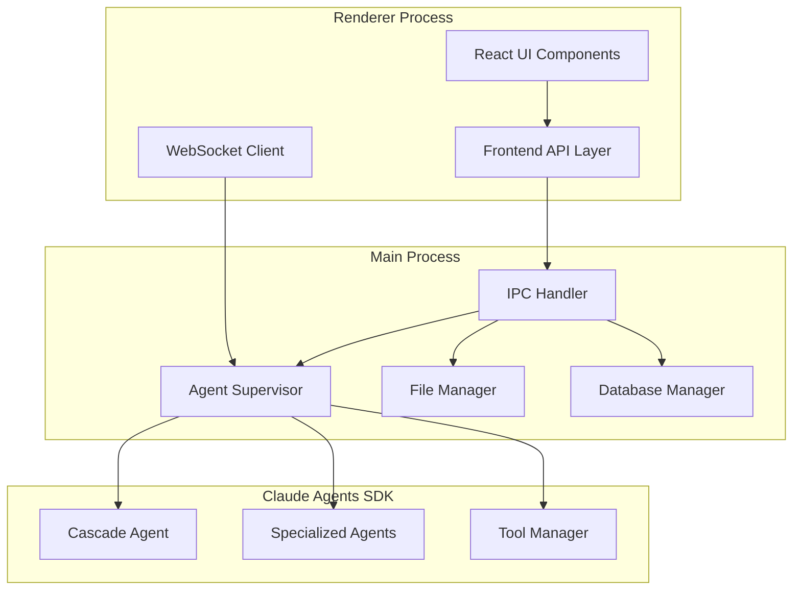

# Author - API Design

## Overview

The Author application uses a multi-layered API architecture to handle communication between the Electron main process, renderer process, and the Claude Agents SDK. This document outlines the API design patterns, interfaces, and data structures used throughout the application.

## Architecture Layers



## IPC (Inter-Process Communication) API

### Core IPC Channels

#### Project Management
```typescript
// Channel: 'project:create'
interface CreateProjectRequest {
  name: string;
  type: 'novel' | 'non-fiction' | 'screenplay' | 'academic';
  template?: string;
  location: string;
  settings: ProjectSettings;
}

interface CreateProjectResponse {
  success: boolean;
  projectId: string;
  projectPath: string;
  error?: string;
}

// Channel: 'project:open'
interface OpenProjectRequest {
  projectPath: string;
}

interface OpenProjectResponse {
  success: boolean;
  project: Project;
  error?: string;
}

// Channel: 'project:list'
interface ListProjectsResponse {
  projects: ProjectSummary[];
}
```

#### File Operations
```typescript
// Channel: 'file:create'
interface CreateFileRequest {
  projectId: string;
  path: string;
  type: 'chapter' | 'scene' | 'character' | 'location' | 'note';
  content?: string;
  metadata?: FileMetadata;
}

interface CreateFileResponse {
  success: boolean;
  fileId: string;
  error?: string;
}

// Channel: 'file:read'
interface ReadFileRequest {
  projectId: string;
  fileId: string;
}

interface ReadFileResponse {
  success: boolean;
  content: string;
  metadata: FileMetadata;
  error?: string;
}

// Channel: 'file:write'
interface WriteFileRequest {
  projectId: string;
  fileId: string;
  content: string;
  metadata?: Partial<FileMetadata>;
}

interface WriteFileResponse {
  success: boolean;
  version: number;
  error?: string;
}
```

#### Agent Communication
```typescript
// Channel: 'agent:request'
interface AgentRequest {
  agentType: 'cascade' | 'planning' | 'writing' | 'editing' | 'research';
  action: string;
  context: AgentContext;
  parameters: Record<string, any>;
  sessionId?: string;
  usePlanningTools?: boolean;
  trackProgress?: boolean;
  createContextNotes?: boolean;
}

interface AgentResponse {
  success: boolean;
  result: any;
  context: AgentContext;
  suggestions?: string[];
  todos?: Todo[];
  progressUpdates?: ProgressUpdate[];
  filesCreated?: string[];
  contextNotes?: ContextNote[];
  error?: string;
}

// Channel: 'agent:stream'
interface AgentStreamRequest {
  agentType: string;
  action: string;
  context: AgentContext;
  parameters: Record<string, any>;
}

interface AgentStreamResponse {
  type: 'start' | 'chunk' | 'end' | 'error';
  data: any;
  error?: string;
}
```

## Data Models

### Core Entities

#### Project
```typescript
interface Project {
  id: string;
  name: string;
  type: ProjectType;
  createdAt: Date;
  updatedAt: Date;
  settings: ProjectSettings;
  structure: ProjectStructure;
  metadata: ProjectMetadata;
  statistics: ProjectStatistics;
}

interface ProjectSettings {
  genre: string;
  targetWordCount: number;
  deadline?: Date;
  writingGoals: WritingGoals;
  aiSettings: AISettings;
  exportSettings: ExportSettings;
}

interface ProjectStructure {
  root: StructureNode;
  files: Map<string, FileNode>;
  relationships: Relationship[];
}

interface StructureNode {
  id: string;
  name: string;
  type: NodeType;
  children: StructureNode[];
  metadata: NodeMetadata;
}
```

#### File System
```typescript
interface FileNode {
  id: string;
  name: string;
  path: string;
  type: FileType;
  content: string;
  metadata: FileMetadata;
  version: number;
  createdAt: Date;
  updatedAt: Date;
}

interface FileMetadata {
  wordCount: number;
  characterCount: number;
  tags: string[];
  status: FileStatus;
  priority: Priority;
  notes: string;
  customFields: Record<string, any>;
}

type FileType = 'chapter' | 'scene' | 'character' | 'location' | 'note' | 'research';
type FileStatus = 'draft' | 'in-progress' | 'review' | 'complete';
type Priority = 'low' | 'medium' | 'high' | 'critical';
```

#### Agent Context
```typescript
interface AgentContext {
  projectId: string;
  currentFile?: string;
  selectedText?: TextSelection;
  recentFiles: string[];
  userPreferences: UserPreferences;
  sessionHistory: ContextItem[];
  relevantContext: ContextItem[];
  activeTodos?: Todo[];
  currentObjectives?: Objective[];
  progressTracking?: ProgressEntry[];
  contextNotes?: ContextNote[];
  sessionSummary?: SessionSummary;
}

// Planning Tools Interfaces
interface Todo {
  id: string;
  content: string;
  status: 'pending' | 'in_progress' | 'completed';
  priority: 'low' | 'medium' | 'high' | 'critical';
  created_at: Date;
  updated_at: Date;
  dependencies?: string[];
  estimated_duration?: number;
  actual_duration?: number;
  notes?: string;
  agent_type?: string;
  session_id?: string;
}

interface ProgressEntry {
  id: string;
  task_id: string;
  progress_percentage: number;
  status_update: string;
  timestamp: Date;
  session_id: string;
  achievements: string[];
  next_steps: string[];
  files_modified?: string[];
}

interface ContextNote {
  id: string;
  topic: string;
  content: string;
  tags: string[];
  agent_type: string;
  session_id: string;
  importance: 'low' | 'medium' | 'high' | 'critical';
  created_at: Date;
  related_files: string[];
  related_tasks: string[];
}

interface Objective {
  id: string;
  title: string;
  description: string;
  status: 'active' | 'completed' | 'paused' | 'cancelled';
  priority: 'low' | 'medium' | 'high' | 'critical';
  target_date?: Date;
  progress_percentage: number;
  milestones: Milestone[];
  related_todos: string[];
}

interface TextSelection {
  fileId: string;
  start: Position;
  end: Position;
  text: string;
}

interface Position {
  line: number;
  column: number;
  offset: number;
}

interface ContextItem {
  type: 'file' | 'selection' | 'character' | 'location' | 'note';
  id: string;
  content: string;
  relevance: number;
  timestamp: Date;
}
```

## Agent API Interfaces

### Cascade Agent
```typescript
interface CascadeAgent {
  // Main orchestration methods
  processRequest(request: AgentRequest): Promise<AgentResponse>;
  delegateTask(task: Task, targetAgent: string): Promise<TaskResult>;
  manageContext(context: AgentContext): Promise<OptimizedContext>;
  
  // Multi-step operations
  executeWorkflow(workflow: Workflow): Promise<WorkflowResult>;
  monitorProgress(operationId: string): Promise<ProgressUpdate>;
  
  // Context management
  compactContext(context: AgentContext): Promise<CompactedContext>;
  retrieveRelevantContext(query: string): Promise<ContextItem[]>;
}

interface Task {
  id: string;
  type: TaskType;
  description: string;
  parameters: Record<string, any>;
  priority: Priority;
  dependencies: string[];
}

interface Workflow {
  id: string;
  name: string;
  steps: WorkflowStep[];
  context: AgentContext;
}

interface WorkflowStep {
  id: string;
  agentType: string;
  action: string;
  parameters: Record<string, any>;
  condition?: string;
}
```

### Planning Agent
```typescript
interface PlanningAgent {
  // Story structure
  analyzeStructure(manuscript: string): Promise<StructureAnalysis>;
  generateOutline(parameters: OutlineParameters): Promise<Outline>;
  suggestPlotPoints(context: PlotContext): Promise<PlotPoint[]>;
  
  // Character development
  analyzeCharacterArcs(characters: Character[]): Promise<CharacterArcAnalysis>;
  suggestCharacterDevelopment(character: Character): Promise<DevelopmentSuggestion[]>;
  
  // Timeline and pacing
  analyzeTimeline(events: Event[]): Promise<TimelineAnalysis>;
  suggestPacingImprovements(manuscript: string): Promise<Pacingsuggestion[]>;
}

interface StructureAnalysis {
  acts: Act[];
  plotPoints: PlotPoint[];
  pacingIssues: PacingIssue[];
  suggestions: string[];
}

interface Outline {
  title: string;
  summary: string;
  acts: Act[];
  chapters: Chapter[];
  scenes: Scene[];
}

interface Character {
  id: string;
  name: string;
  description: string;
  personality: PersonalityTraits;
  background: string;
  goals: string[];
  conflicts: string[];
  relationships: Relationship[];
}
```

### Writing Agent
```typescript
interface WritingAgent {
  // Content generation
  generateContent(prompt: ContentPrompt): Promise<GeneratedContent>;
  expandScene(scene: Scene, parameters: ExpansionParameters): Promise<string>;
  improveDialogue(dialogue: string, characters: Character[]): Promise<string>;
  
  // Style and voice
  matchStyle(sample: string, content: string): Promise<string>;
  maintainVoice(content: string, voiceProfile: VoiceProfile): Promise<string>;
  
  // Genre-specific writing
  applyGenreConventions(content: string, genre: string): Promise<string>;
  suggestGenreElements(genre: string, context: string): Promise<GenreElement[]>;
}

interface ContentPrompt {
  type: 'scene' | 'dialogue' | 'description' | 'transition';
  context: string;
  characters: Character[];
  setting: Location;
  mood: string;
  length: number;
  style: StylePreferences;
}

interface GeneratedContent {
  content: string;
  alternatives: string[];
  suggestions: string[];
  confidence: number;
}
```

### Editing Agent
```typescript
interface EditingAgent {
  // Grammar and style
  checkGrammar(text: string): Promise<GrammarIssue[]>;
  analyzeStyle(text: string): Promise<StyleAnalysis>;
  suggestImprovements(text: string): Promise<EditingSuggestion[]>;
  
  // Developmental editing
  analyzePacing(manuscript: string): Promise<PacingAnalysis>;
  checkContinuity(manuscript: string): Promise<ContinuityIssue[]>;
  suggestStructuralChanges(manuscript: string): Promise<StructuralSuggestion[]>;
  
  // Copy editing
  proofread(text: string): Promise<ProofreadingResult>;
  checkConsistency(manuscript: string): Promise<ConsistencyIssue[]>;
}

interface GrammarIssue {
  type: string;
  message: string;
  position: Position;
  suggestions: string[];
  severity: 'error' | 'warning' | 'suggestion';
}

interface EditingSuggestion {
  type: 'grammar' | 'style' | 'clarity' | 'flow';
  original: string;
  suggested: string;
  reason: string;
  confidence: number;
}
```

### Research Agent
```typescript
interface ResearchAgent {
  // Fact checking
  verifyFacts(claims: string[]): Promise<FactCheckResult[]>;
  findSources(topic: string): Promise<Source[]>;
  
  // Background research
  researchTopic(topic: string, depth: ResearchDepth): Promise<ResearchResult>;
  findExpertSources(field: string): Promise<ExpertSource[]>;
  
  // Reference management
  formatCitation(source: Source, style: CitationStyle): Promise<string>;
  generateBibliography(sources: Source[]): Promise<string>;
}

interface FactCheckResult {
  claim: string;
  verified: boolean;
  confidence: number;
  sources: Source[];
  notes: string;
}

interface ResearchResult {
  topic: string;
  summary: string;
  keyPoints: string[];
  sources: Source[];
  relatedTopics: string[];
}
```

## WebSocket API for Real-time Features

### Connection Management
```typescript
interface WebSocketMessage {
  type: MessageType;
  id: string;
  timestamp: Date;
  data: any;
}

type MessageType = 
  | 'agent_progress'
  | 'file_change'
  | 'collaboration_update'
  | 'system_notification'
  | 'error';

// Agent progress updates
interface AgentProgressMessage {
  type: 'agent_progress';
  data: {
    operationId: string;
    agentType: string;
    status: 'started' | 'in_progress' | 'completed' | 'error';
    progress: number;
    message: string;
    result?: any;
  };
}

// File change notifications
interface FileChangeMessage {
  type: 'file_change';
  data: {
    projectId: string;
    fileId: string;
    changeType: 'created' | 'modified' | 'deleted';
    content?: string;
    metadata?: FileMetadata;
  };
}
```

## Error Handling

### Error Types
```typescript
interface APIError {
  code: string;
  message: string;
  details?: any;
  timestamp: Date;
  context?: string;
}

enum ErrorCode {
  // File system errors
  FILE_NOT_FOUND = 'FILE_NOT_FOUND',
  FILE_ACCESS_DENIED = 'FILE_ACCESS_DENIED',
  FILE_CORRUPTED = 'FILE_CORRUPTED',
  
  // Agent errors
  AGENT_UNAVAILABLE = 'AGENT_UNAVAILABLE',
  AGENT_TIMEOUT = 'AGENT_TIMEOUT',
  AGENT_CONTEXT_OVERFLOW = 'AGENT_CONTEXT_OVERFLOW',
  
  // Project errors
  PROJECT_NOT_FOUND = 'PROJECT_NOT_FOUND',
  PROJECT_CORRUPTED = 'PROJECT_CORRUPTED',
  PROJECT_ACCESS_DENIED = 'PROJECT_ACCESS_DENIED',
  
  // Network errors
  NETWORK_UNAVAILABLE = 'NETWORK_UNAVAILABLE',
  API_RATE_LIMITED = 'API_RATE_LIMITED',
  API_AUTHENTICATION_FAILED = 'API_AUTHENTICATION_FAILED',
  
  // Validation errors
  INVALID_INPUT = 'INVALID_INPUT',
  VALIDATION_FAILED = 'VALIDATION_FAILED'
}
```

### Error Response Format
```typescript
interface ErrorResponse {
  success: false;
  error: APIError;
  retryable: boolean;
  retryAfter?: number;
}
```

## Rate Limiting and Throttling

### API Rate Limits
```typescript
interface RateLimitConfig {
  windowMs: number;
  maxRequests: number;
  skipSuccessfulRequests: boolean;
  skipFailedRequests: boolean;
}

interface RateLimitStatus {
  limit: number;
  remaining: number;
  resetTime: Date;
  retryAfter?: number;
}
```

## Authentication and Security

### API Key Management
```typescript
interface APIKeyConfig {
  provider: 'anthropic' | 'openai' | 'custom';
  key: string;
  endpoint?: string;
  rateLimits: RateLimitConfig;
}

interface SecurityContext {
  userId: string;
  permissions: Permission[];
  sessionId: string;
  expiresAt: Date;
}

interface Permission {
  resource: string;
  actions: string[];
  conditions?: Record<string, any>;
}
```

## Versioning and Compatibility

### API Versioning
```typescript
interface APIVersion {
  major: number;
  minor: number;
  patch: number;
  prerelease?: string;
}

interface CompatibilityInfo {
  minVersion: APIVersion;
  maxVersion: APIVersion;
  deprecated: boolean;
  deprecationDate?: Date;
  migrationGuide?: string;
}
```

This API design provides a comprehensive foundation for the Author application, ensuring type safety, clear interfaces, and robust error handling across all system components.
