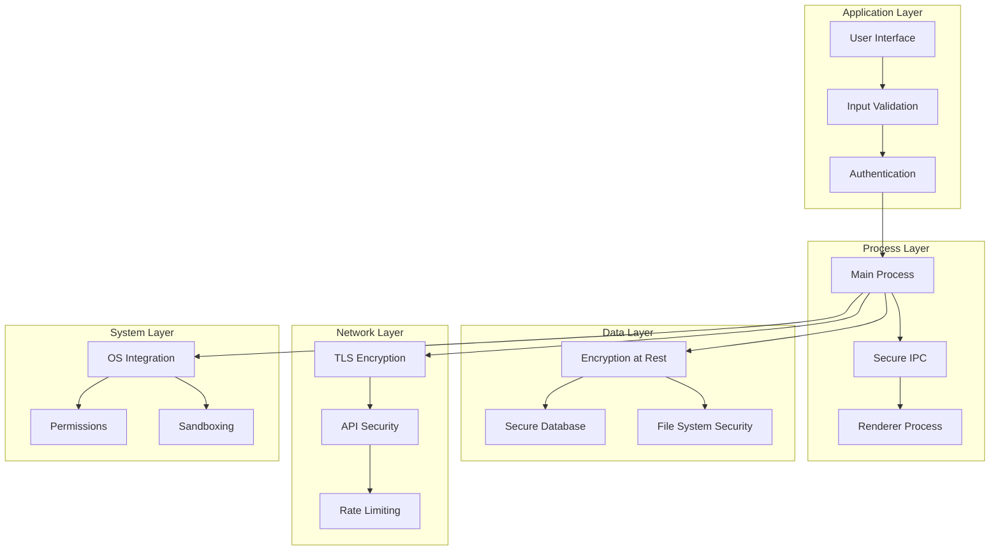

# Author - Security and Privacy Framework

## Overview

The Author application prioritizes user privacy and data security, implementing a comprehensive security framework that protects intellectual property, personal information, and ensures secure AI interactions while maintaining a seamless user experience.

## Security Architecture

### Defense in Depth Strategy



## Data Protection

### Local Data Security

#### Encryption at Rest
```typescript
interface EncryptionConfig {
  algorithm: 'AES-256-GCM';
  keyDerivation: 'PBKDF2';
  iterations: 100000;
  saltLength: 32;
  ivLength: 16;
}

class DataEncryption {
  private config: EncryptionConfig;
  private masterKey: Buffer;
  
  async encryptFile(filePath: string, data: Buffer): Promise<void> {
    const salt = crypto.randomBytes(this.config.saltLength);
    const iv = crypto.randomBytes(this.config.ivLength);
    const key = await this.deriveKey(this.masterKey, salt);
    
    const cipher = crypto.createCipher(this.config.algorithm, key, iv);
    const encrypted = Buffer.concat([cipher.update(data), cipher.final()]);
    const authTag = cipher.getAuthTag();
    
    const encryptedData = Buffer.concat([salt, iv, authTag, encrypted]);
    await fs.writeFile(filePath, encryptedData);
  }
  
  async decryptFile(filePath: string): Promise<Buffer> {
    const encryptedData = await fs.readFile(filePath);
    const salt = encryptedData.slice(0, this.config.saltLength);
    const iv = encryptedData.slice(this.config.saltLength, this.config.saltLength + this.config.ivLength);
    const authTag = encryptedData.slice(this.config.saltLength + this.config.ivLength, this.config.saltLength + this.config.ivLength + 16);
    const encrypted = encryptedData.slice(this.config.saltLength + this.config.ivLength + 16);
    
    const key = await this.deriveKey(this.masterKey, salt);
    const decipher = crypto.createDecipher(this.config.algorithm, key, iv);
    decipher.setAuthTag(authTag);
    
    return Buffer.concat([decipher.update(encrypted), decipher.final()]);
  }
}
```

#### Database Security
```sql
-- Enable SQLite encryption (requires SQLCipher)
PRAGMA key = 'user-derived-encryption-key';
PRAGMA cipher_page_size = 4096;
PRAGMA kdf_iter = 64000;
PRAGMA cipher_hmac_algorithm = HMAC_SHA512;
PRAGMA cipher_kdf_algorithm = PBKDF2_HMAC_SHA512;

-- Row-level security for sensitive data
CREATE TABLE secure_user_data (
    id TEXT PRIMARY KEY,
    user_id TEXT NOT NULL,
    encrypted_data BLOB NOT NULL,
    created_at DATETIME DEFAULT CURRENT_TIMESTAMP,
    CHECK (user_id = current_user_id())
);
```

### File System Protection

#### Secure File Operations
```typescript
class SecureFileManager {
  private readonly allowedExtensions = ['.md', '.txt', '.json', '.docx'];
  private readonly maxFileSize = 100 * 1024 * 1024; // 100MB
  
  async validateFilePath(filePath: string): Promise<boolean> {
    // Prevent directory traversal attacks
    const normalizedPath = path.normalize(filePath);
    if (normalizedPath.includes('..')) {
      throw new SecurityError('Invalid file path detected');
    }
    
    // Ensure file is within project directory
    const projectRoot = await this.getProjectRoot();
    if (!normalizedPath.startsWith(projectRoot)) {
      throw new SecurityError('File access outside project directory denied');
    }
    
    return true;
  }
  
  async secureFileWrite(filePath: string, content: string): Promise<void> {
    await this.validateFilePath(filePath);
    
    // Check file size
    if (Buffer.byteLength(content, 'utf8') > this.maxFileSize) {
      throw new SecurityError('File size exceeds maximum allowed');
    }
    
    // Atomic write operation
    const tempPath = `${filePath}.tmp`;
    await fs.writeFile(tempPath, content, { mode: 0o600 });
    await fs.rename(tempPath, filePath);
  }
}
```

## Network Security

### API Communication Security

#### Secure API Client
```typescript
class SecureAPIClient {
  private apiKey: string;
  private baseURL: string;
  private rateLimiter: RateLimiter;
  
  constructor(config: APIConfig) {
    this.apiKey = this.securelyStoreAPIKey(config.apiKey);
    this.baseURL = config.baseURL;
    this.rateLimiter = new RateLimiter(config.rateLimit);
  }
  
  async makeRequest(endpoint: string, data: any): Promise<any> {
    // Rate limiting
    await this.rateLimiter.checkLimit();
    
    // Input sanitization
    const sanitizedData = this.sanitizeInput(data);
    
    // Request with security headers
    const response = await fetch(`${this.baseURL}${endpoint}`, {
      method: 'POST',
      headers: {
        'Authorization': `Bearer ${this.apiKey}`,
        'Content-Type': 'application/json',
        'User-Agent': 'Author/1.0.0',
        'X-Request-ID': crypto.randomUUID(),
      },
      body: JSON.stringify(sanitizedData),
    });
    
    if (!response.ok) {
      throw new APIError(`Request failed: ${response.status}`);
    }
    
    return await response.json();
  }
  
  private sanitizeInput(data: any): any {
    // Remove potentially dangerous content
    if (typeof data === 'string') {
      return data.replace(/<script\b[^<]*(?:(?!<\/script>)<[^<]*)*<\/script>/gi, '');
    }
    
    if (typeof data === 'object' && data !== null) {
      const sanitized: any = {};
      for (const [key, value] of Object.entries(data)) {
        sanitized[key] = this.sanitizeInput(value);
      }
      return sanitized;
    }
    
    return data;
  }
}
```

### Certificate Pinning
```typescript
class CertificatePinner {
  private pinnedCertificates: Map<string, string[]> = new Map();
  
  constructor() {
    // Pin certificates for known API endpoints
    this.pinnedCertificates.set('api.anthropic.com', [
      'sha256/AAAAAAAAAAAAAAAAAAAAAAAAAAAAAAAAAAAAAAAAAAA=', // Primary cert
      'sha256/BBBBBBBBBBBBBBBBBBBBBBBBBBBBBBBBBBBBBBBBBBB=', // Backup cert
    ]);
  }
  
  validateCertificate(hostname: string, certificate: string): boolean {
    const pinnedHashes = this.pinnedCertificates.get(hostname);
    if (!pinnedHashes) {
      return true; // No pinning configured
    }
    
    const certHash = crypto.createHash('sha256').update(certificate).digest('base64');
    return pinnedHashes.includes(`sha256/${certHash}`);
  }
}
```

## Authentication and Authorization

### User Authentication
```typescript
interface UserCredentials {
  username: string;
  passwordHash: string;
  salt: string;
  iterations: number;
}

class AuthenticationManager {
  private readonly minPasswordLength = 12;
  private readonly maxLoginAttempts = 5;
  private readonly lockoutDuration = 15 * 60 * 1000; // 15 minutes
  
  async hashPassword(password: string): Promise<{hash: string, salt: string}> {
    const salt = crypto.randomBytes(32).toString('hex');
    const hash = await bcrypt.hash(password + salt, 12);
    return { hash, salt };
  }
  
  async verifyPassword(password: string, hash: string, salt: string): Promise<boolean> {
    return await bcrypt.compare(password + salt, hash);
  }
  
  validatePasswordStrength(password: string): boolean {
    if (password.length < this.minPasswordLength) return false;
    
    const hasUpperCase = /[A-Z]/.test(password);
    const hasLowerCase = /[a-z]/.test(password);
    const hasNumbers = /\d/.test(password);
    const hasSpecialChar = /[!@#$%^&*(),.?":{}|<>]/.test(password);
    
    return hasUpperCase && hasLowerCase && hasNumbers && hasSpecialChar;
  }
}
```

### Session Management
```typescript
class SessionManager {
  private sessions: Map<string, Session> = new Map();
  private readonly sessionTimeout = 24 * 60 * 60 * 1000; // 24 hours
  
  createSession(userId: string): string {
    const sessionId = crypto.randomUUID();
    const session: Session = {
      id: sessionId,
      userId,
      createdAt: new Date(),
      lastActivity: new Date(),
      permissions: this.getUserPermissions(userId),
    };
    
    this.sessions.set(sessionId, session);
    this.scheduleSessionCleanup(sessionId);
    
    return sessionId;
  }
  
  validateSession(sessionId: string): Session | null {
    const session = this.sessions.get(sessionId);
    if (!session) return null;
    
    const now = new Date();
    if (now.getTime() - session.lastActivity.getTime() > this.sessionTimeout) {
      this.sessions.delete(sessionId);
      return null;
    }
    
    session.lastActivity = now;
    return session;
  }
}
```

## Privacy Protection

### Data Minimization
```typescript
class PrivacyManager {
  private dataRetentionPolicies: Map<string, number> = new Map([
    ['logs', 30 * 24 * 60 * 60 * 1000], // 30 days
    ['analytics', 90 * 24 * 60 * 60 * 1000], // 90 days
    ['temp_files', 24 * 60 * 60 * 1000], // 24 hours
  ]);
  
  async cleanupExpiredData(): Promise<void> {
    for (const [dataType, retention] of this.dataRetentionPolicies) {
      const cutoffDate = new Date(Date.now() - retention);
      await this.deleteDataOlderThan(dataType, cutoffDate);
    }
  }
  
  async anonymizeUserData(userId: string): Promise<void> {
    // Replace personal identifiers with anonymous tokens
    const anonymousId = crypto.randomUUID();
    
    await this.database.run(`
      UPDATE user_sessions 
      SET user_id = ? 
      WHERE user_id = ?
    `, [anonymousId, userId]);
    
    await this.database.run(`
      UPDATE application_log 
      SET user_id = ? 
      WHERE user_id = ?
    `, [anonymousId, userId]);
  }
}
```

### Consent Management
```typescript
interface ConsentPreferences {
  analytics: boolean;
  crashReporting: boolean;
  usageStatistics: boolean;
  aiTraining: boolean;
  cloudSync: boolean;
}

class ConsentManager {
  private preferences: ConsentPreferences;
  
  async updateConsent(preferences: Partial<ConsentPreferences>): Promise<void> {
    this.preferences = { ...this.preferences, ...preferences };
    await this.savePreferences();
    
    // Apply consent decisions
    if (!preferences.analytics) {
      await this.disableAnalytics();
    }
    
    if (!preferences.crashReporting) {
      await this.disableCrashReporting();
    }
    
    if (!preferences.aiTraining) {
      await this.optOutOfAITraining();
    }
  }
  
  canCollectData(dataType: keyof ConsentPreferences): boolean {
    return this.preferences[dataType] === true;
  }
}
```

## Secure AI Integration

### Context Sanitization
```typescript
class AIContextSanitizer {
  private sensitivePatterns = [
    /\b\d{4}[-\s]?\d{4}[-\s]?\d{4}[-\s]?\d{4}\b/, // Credit card numbers
    /\b\d{3}-\d{2}-\d{4}\b/, // SSN
    /\b[A-Za-z0-9._%+-]+@[A-Za-z0-9.-]+\.[A-Z|a-z]{2,}\b/, // Email addresses
    /\b\d{3}[-.]?\d{3}[-.]?\d{4}\b/, // Phone numbers
  ];
  
  sanitizeContext(context: string): string {
    let sanitized = context;
    
    for (const pattern of this.sensitivePatterns) {
      sanitized = sanitized.replace(pattern, '[REDACTED]');
    }
    
    return sanitized;
  }
  
  async validateAIRequest(request: any): Promise<boolean> {
    // Check for sensitive data in request
    const requestString = JSON.stringify(request);
    
    for (const pattern of this.sensitivePatterns) {
      if (pattern.test(requestString)) {
        console.warn('Sensitive data detected in AI request');
        return false;
      }
    }
    
    return true;
  }
}
```

### API Key Security
```typescript
class APIKeyManager {
  private keystore: Map<string, EncryptedKey> = new Map();
  
  async storeAPIKey(provider: string, key: string): Promise<void> {
    const encryptedKey = await this.encryptKey(key);
    this.keystore.set(provider, encryptedKey);
    await this.persistKeystore();
  }
  
  async getAPIKey(provider: string): Promise<string | null> {
    const encryptedKey = this.keystore.get(provider);
    if (!encryptedKey) return null;
    
    return await this.decryptKey(encryptedKey);
  }
  
  private async encryptKey(key: string): Promise<EncryptedKey> {
    const salt = crypto.randomBytes(32);
    const iv = crypto.randomBytes(16);
    const derivedKey = await this.deriveKeyFromPassword(salt);
    
    const cipher = crypto.createCipher('aes-256-gcm', derivedKey, iv);
    const encrypted = Buffer.concat([cipher.update(key, 'utf8'), cipher.final()]);
    const authTag = cipher.getAuthTag();
    
    return {
      encrypted: encrypted.toString('base64'),
      salt: salt.toString('base64'),
      iv: iv.toString('base64'),
      authTag: authTag.toString('base64'),
    };
  }
}
```

## Security Monitoring

### Intrusion Detection
```typescript
class SecurityMonitor {
  private suspiciousActivities: SuspiciousActivity[] = [];
  private alertThresholds = {
    failedLogins: 5,
    rapidRequests: 100,
    largeFileAccess: 10,
  };
  
  logSecurityEvent(event: SecurityEvent): void {
    this.suspiciousActivities.push({
      ...event,
      timestamp: new Date(),
    });
    
    this.analyzeSecurityEvents();
  }
  
  private analyzeSecurityEvents(): void {
    const recentEvents = this.getRecentEvents(5 * 60 * 1000); // Last 5 minutes
    
    // Check for brute force attacks
    const failedLogins = recentEvents.filter(e => e.type === 'failed_login').length;
    if (failedLogins >= this.alertThresholds.failedLogins) {
      this.triggerSecurityAlert('BRUTE_FORCE_DETECTED', { attempts: failedLogins });
    }
    
    // Check for rapid API requests
    const apiRequests = recentEvents.filter(e => e.type === 'api_request').length;
    if (apiRequests >= this.alertThresholds.rapidRequests) {
      this.triggerSecurityAlert('RAPID_REQUESTS_DETECTED', { requests: apiRequests });
    }
  }
  
  private triggerSecurityAlert(alertType: string, details: any): void {
    console.error(`Security Alert: ${alertType}`, details);
    
    // Implement response actions
    switch (alertType) {
      case 'BRUTE_FORCE_DETECTED':
        this.temporarilyLockAccount();
        break;
      case 'RAPID_REQUESTS_DETECTED':
        this.enableRateLimiting();
        break;
    }
  }
}
```

## Compliance and Auditing

### GDPR Compliance
```typescript
class GDPRCompliance {
  async handleDataSubjectRequest(request: DataSubjectRequest): Promise<void> {
    switch (request.type) {
      case 'ACCESS':
        await this.exportUserData(request.userId);
        break;
      case 'RECTIFICATION':
        await this.updateUserData(request.userId, request.corrections);
        break;
      case 'ERASURE':
        await this.deleteUserData(request.userId);
        break;
      case 'PORTABILITY':
        await this.exportUserDataPortable(request.userId);
        break;
    }
  }
  
  async exportUserData(userId: string): Promise<UserDataExport> {
    const userData = await this.collectAllUserData(userId);
    
    return {
      personalData: userData.personal,
      projectData: userData.projects,
      preferences: userData.preferences,
      activityLog: userData.activities,
      exportDate: new Date(),
    };
  }
  
  async deleteUserData(userId: string): Promise<void> {
    // Anonymize instead of delete to maintain data integrity
    await this.anonymizeUserData(userId);
    
    // Delete personal identifiers
    await this.database.run('DELETE FROM user_profiles WHERE id = ?', [userId]);
    
    // Log the deletion
    await this.auditLog.log('USER_DATA_DELETED', { userId, timestamp: new Date() });
  }
}
```

### Security Audit Trail
```typescript
class AuditLogger {
  async logSecurityEvent(event: AuditEvent): Promise<void> {
    const auditEntry = {
      id: crypto.randomUUID(),
      timestamp: new Date(),
      userId: event.userId,
      action: event.action,
      resource: event.resource,
      outcome: event.outcome,
      ipAddress: event.ipAddress,
      userAgent: event.userAgent,
      details: event.details,
    };
    
    await this.database.run(`
      INSERT INTO audit_log (
        id, timestamp, user_id, action, resource, 
        outcome, ip_address, user_agent, details
      ) VALUES (?, ?, ?, ?, ?, ?, ?, ?, ?)
    `, Object.values(auditEntry));
  }
  
  async generateSecurityReport(startDate: Date, endDate: Date): Promise<SecurityReport> {
    const events = await this.database.all(`
      SELECT * FROM audit_log 
      WHERE timestamp BETWEEN ? AND ?
      ORDER BY timestamp DESC
    `, [startDate, endDate]);
    
    return {
      totalEvents: events.length,
      failedLogins: events.filter(e => e.action === 'LOGIN' && e.outcome === 'FAILURE').length,
      dataAccess: events.filter(e => e.action.includes('DATA_ACCESS')).length,
      securityAlerts: events.filter(e => e.action.includes('SECURITY_ALERT')).length,
      events: events,
    };
  }
}
```

This comprehensive security and privacy framework ensures that the Author application maintains the highest standards of data protection while providing a seamless user experience for creative professionals.
