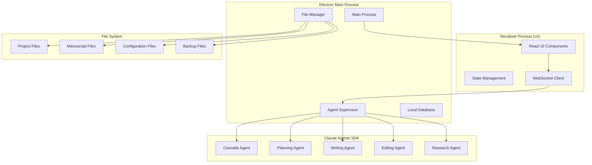

# Author - Technical Architecture

## System Architecture Overview



## Core Components

### 1. Electron Framework
- **Main Process**: Handles system-level operations, file management, and agent coordination
- **Renderer Process**: React-based UI with modern component architecture
- **IPC Communication**: Secure communication between main and renderer processes
- **Native Integration**: File system access, notifications, and system tray

### 2. Claude Agents SDK Integration
- **Core Query System**: Uses `query()` function with streaming input mode (async generators)
- **Built-in Tools**: Leverages `TodoWrite`, `Task`, `ExitPlanMode` for basic functionality
- **Custom MCP Tools**: Book-writing specific tools via `createSdkMcpServer`
- **Subagent System**: Proper subagents using `agents` parameter in query options
- **Streaming Architecture**: Real-time agent communication with message streaming
- **Session Management**: Session resumption and forking for long-term projects
- **Permission System**: Fine-grained tool access control and user permissions

### 3. Multi-Agent System

#### Primary Agent (Claude SDK)
**Main Agent**: Single Claude instance with specialized subagents
- Uses streaming input mode with async generators
- Coordinates all book writing tasks
- Manages project-wide context and session state
- Delegates to specialized subagents as needed

#### Subagents (SDK agents parameter)
1. **Planning Subagent**
   - Story structure and outline development
   - Character arc planning with custom tools
   - Plot consistency checking
   - Timeline management

2. **Writing Subagent**
   - Content generation with style consistency
   - Dialogue enhancement and scene development
   - Integration with manuscript files
   - Real-time writing assistance

3. **Editing Subagent**
   - Multi-level editing (developmental to copy editing)
   - Continuity and consistency checking
   - Pacing analysis and readability optimization
   - Style guide enforcement

4. **Research Subagent**
   - Fact-checking and verification
   - Background research with source management
   - Reference and citation handling
   - Accuracy validation

#### Specialized Sub-Agents
- **Character Development Agent**: Character consistency and growth
- **World-Building Agent**: Setting and environment consistency
- **Genre-Specific Agents**: Romance, mystery, sci-fi, non-fiction specialists

### 4. Advanced File Management System
- **Project Structure**: Hierarchical organization of manuscripts
- **Version Control**: Built-in versioning and backup system
- **Export Formats**: PDF, DOCX, EPUB, LaTeX support
- **Collaboration**: Multi-user project support
- **Agent Progress Files**: Dedicated files for tracking agent progress and objectives
- **Context Notes**: Persistent storage of agent findings and research
- **Task Management Files**: Todo lists and planning documents for complex operations
- **Session Summaries**: Automatic generation of work session summaries

### 5. Middleware Architecture
- **Planning Middleware**: Adds todo/task management capabilities to agents
- **Filesystem Middleware**: Provides file operations and progress tracking
- **Summarization Middleware**: Automatic context compaction when limits are reached
- **Prompt Caching Middleware**: Optimizes API calls with intelligent caching
- **Progress Tracking Middleware**: Real-time updates on agent activities
- **Context Management Middleware**: Dynamic context window optimization

### 6. Context Optimization
- **Semantic Indexing**: Fast retrieval of relevant manuscript sections
- **Memory Management**: Efficient handling of large manuscripts
- **Context Windows**: Dynamic context sizing based on task requirements
- **Caching System**: Intelligent caching of frequently accessed content
- **Automatic Summarization**: Context compaction when approaching token limits
- **Context Isolation**: Separate context windows for subagents to prevent pollution

## Data Flow Architecture

### 1. User Interaction Flow
```
User Input → UI Component → IPC → Main Process → Agent Supervisor → Specific Agent → File System → Response Chain
```

### 2. Agent Communication Flow
```
Cascade Agent → Task Distribution → Sub-Agents → Context Sharing → Result Aggregation → User Presentation
```

### 3. File Operation Flow
```
Agent Request → File Manager → Permission Check → File System Operation → Change Tracking → UI Update
```

## Technology Stack Details

### Frontend (Renderer Process)
- **React 18+**: Modern component architecture with hooks
- **TypeScript**: Type safety and better development experience
- **Tailwind CSS**: Utility-first styling framework
- **shadcn/ui**: High-quality component library
- **Monaco Editor**: Advanced text editing capabilities
- **React Query**: State management and caching

### Backend (Main Process)
- **Node.js**: JavaScript runtime for main process
- **TypeScript**: Type safety across the application
- **SQLite**: Local database for project metadata
- **fs-extra**: Enhanced file system operations
- **chokidar**: File system watching for real-time updates

### AI Integration
- **Claude Agents SDK**: Core AI agent functionality with streaming
- **@anthropic-ai/claude-agent-sdk**: Official TypeScript SDK with proper integration
- **Custom MCP Server**: Book-specific tools via `createSdkMcpServer`
- **Built-in Tools**: `TodoWrite`, `Task`, `Read`, `Edit`, `Write`, `Bash`
- **Session Management**: Resumption and forking for long projects
- **Permission Control**: `canUseTool` callbacks and permission modes

### Build and Distribution
- **Electron Builder**: Application packaging and distribution
- **Webpack**: Module bundling and optimization
- **ESLint + Prettier**: Code quality and formatting
- **Jest**: Unit and integration testing
- **GitHub Actions**: CI/CD pipeline

## Security and Privacy

### Data Protection
- **Local-First**: All data stored locally by default
- **Encryption**: Sensitive data encrypted at rest
- **Secure IPC**: Encrypted communication between processes
- **Permission System**: Granular file access controls

### AI Integration Security
- **API Key Management**: Secure storage of Claude API keys
- **Request Filtering**: Sanitization of data sent to AI services
- **Privacy Controls**: User control over data sharing
- **Offline Mode**: Core functionality available without internet

## Performance Optimization

### Memory Management
- **Lazy Loading**: Load manuscript sections on demand
- **Context Compaction**: Automatic summarization of old context
- **Resource Pooling**: Efficient agent resource utilization
- **Garbage Collection**: Proactive memory cleanup

### File System Optimization
- **Incremental Saves**: Save only changed content
- **Background Sync**: Non-blocking file operations
- **Caching Strategy**: Intelligent caching of frequently accessed files
- **Compression**: Efficient storage of large manuscripts

## Scalability Considerations

### Project Size Handling
- **Large Manuscript Support**: Handle books with 100,000+ words
- **Multi-Book Projects**: Series and multi-volume works
- **Collaborative Projects**: Multiple authors and editors
- **Performance Monitoring**: Real-time performance metrics

### Agent Scaling
- **Dynamic Agent Spawning**: Create agents based on workload
- **Resource Allocation**: Intelligent resource distribution
- **Queue Management**: Task prioritization and scheduling
- **Load Balancing**: Distribute work across available agents
