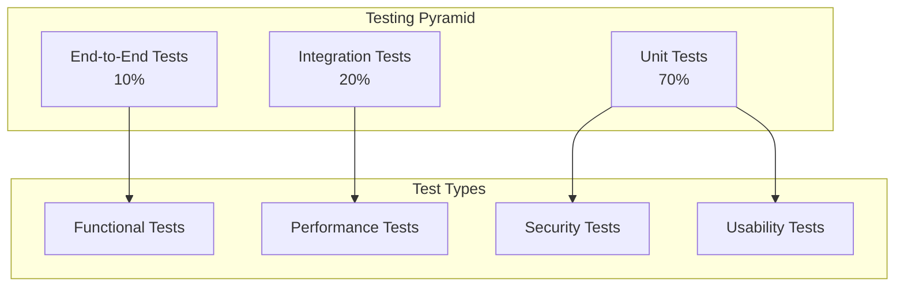

# Author - Testing Strategy

## Testing Overview

The Author application employs a comprehensive testing strategy that ensures reliability, performance, and user satisfaction across all components. Our testing approach covers unit testing, integration testing, end-to-end testing, performance testing, and user acceptance testing.

## Testing Pyramid



## Unit Testing

### Frontend Unit Tests (React Components)

#### Component Testing Framework
```typescript
// Test setup with React Testing Library and Jest
import { render, screen, fireEvent, waitFor } from '@testing-library/react';
import { jest } from '@jest/globals';
import { ProjectDashboard } from '../components/ProjectDashboard';
import { mockProject } from '../__mocks__/projectData';

describe('ProjectDashboard', () => {
  beforeEach(() => {
    jest.clearAllMocks();
  });

  it('should render project information correctly', () => {
    render(<ProjectDashboard project={mockProject} />);
    
    expect(screen.getByText(mockProject.name)).toBeInTheDocument();
    expect(screen.getByText(`${mockProject.currentWordCount} words`)).toBeInTheDocument();
    expect(screen.getByRole('progressbar')).toHaveAttribute(
      'aria-valuenow', 
      String(Math.round((mockProject.currentWordCount / mockProject.targetWordCount) * 100))
    );
  });

  it('should handle project creation', async () => {
    const mockCreateProject = jest.fn().mockResolvedValue({ success: true });
    render(<ProjectDashboard onCreateProject={mockCreateProject} />);
    
    fireEvent.click(screen.getByText('New Project'));
    fireEvent.change(screen.getByLabelText('Project Name'), { 
      target: { value: 'Test Novel' } 
    });
    fireEvent.click(screen.getByText('Create'));
    
    await waitFor(() => {
      expect(mockCreateProject).toHaveBeenCalledWith({
        name: 'Test Novel',
        type: 'novel',
        template: 'default'
      });
    });
  });

  it('should display error states appropriately', () => {
    const errorProject = { ...mockProject, error: 'Failed to load project' };
    render(<ProjectDashboard project={errorProject} />);
    
    expect(screen.getByText('Failed to load project')).toBeInTheDocument();
    expect(screen.getByRole('alert')).toBeInTheDocument();
  });
});
```

#### Agent Integration Tests
```typescript
describe('AgentManager', () => {
  let agentManager: AgentManager;
  let mockClaudeSDK: jest.Mocked<ClaudeAgentSDK>;

  beforeEach(() => {
    mockClaudeSDK = {
      createAgent: jest.fn(),
      sendMessage: jest.fn(),
      getContext: jest.fn(),
    } as any;
    
    agentManager = new AgentManager(mockClaudeSDK);
  });

  it('should create specialized agents correctly', async () => {
    const planningAgent = await agentManager.createAgent('planning');
    
    expect(mockClaudeSDK.createAgent).toHaveBeenCalledWith({
      type: 'planning',
      tools: expect.arrayContaining(['story_structure', 'character_arc']),
      systemPrompt: expect.stringContaining('story planning')
    });
    
    expect(planningAgent).toBeDefined();
    expect(planningAgent.type).toBe('planning');
  });

  it('should handle agent communication errors', async () => {
    mockClaudeSDK.sendMessage.mockRejectedValue(new Error('API Error'));
    
    const agent = await agentManager.createAgent('writing');
    
    await expect(agent.generateContent('Write a scene')).rejects.toThrow('API Error');
    expect(agentManager.getErrorCount()).toBe(1);
  });

  it('should manage context efficiently', async () => {
    const agent = await agentManager.createAgent('editing');
    const largeContext = 'x'.repeat(100000); // Large context
    
    await agent.processText(largeContext);
    
    expect(mockClaudeSDK.getContext).toHaveBeenCalled();
    // Verify context was compacted if too large
    const contextSize = mockClaudeSDK.getContext.mock.calls[0][0].length;
    expect(contextSize).toBeLessThan(50000);
  });
});
```

### Backend Unit Tests (Main Process)

#### File Management Tests
```typescript
describe('FileManager', () => {
  let fileManager: FileManager;
  let tempDir: string;

  beforeEach(async () => {
    tempDir = await fs.mkdtemp(path.join(os.tmpdir(), 'author-test-'));
    fileManager = new FileManager(tempDir);
  });

  afterEach(async () => {
    await fs.rm(tempDir, { recursive: true, force: true });
  });

  it('should create project structure correctly', async () => {
    const projectId = 'test-project';
    const structure = await fileManager.createProjectStructure(projectId, {
      name: 'Test Novel',
      type: 'novel',
      chapters: ['Chapter 1', 'Chapter 2']
    });

    expect(structure.root.children).toHaveLength(2);
    expect(await fs.access(path.join(tempDir, projectId, 'chapters'))).not.toThrow();
  });

  it('should handle file operations atomically', async () => {
    const filePath = path.join(tempDir, 'test.md');
    const content = 'Test content';

    // Simulate interruption during write
    const writePromise = fileManager.writeFile(filePath, content);
    
    // File should not exist until write completes
    expect(fs.access(filePath)).rejects.toThrow();
    
    await writePromise;
    
    // File should exist after completion
    expect(await fs.readFile(filePath, 'utf8')).toBe(content);
  });

  it('should validate file paths for security', async () => {
    const maliciousPath = '../../../etc/passwd';
    
    await expect(fileManager.writeFile(maliciousPath, 'content'))
      .rejects.toThrow('Invalid file path');
  });
});
```

#### Database Tests
```typescript
describe('DatabaseManager', () => {
  let db: DatabaseManager;
  let dbPath: string;

  beforeEach(async () => {
    dbPath = path.join(os.tmpdir(), `test-${Date.now()}.db`);
    db = new DatabaseManager(dbPath);
    await db.initialize();
  });

  afterEach(async () => {
    await db.close();
    await fs.unlink(dbPath);
  });

  it('should create projects with proper constraints', async () => {
    const project = {
      id: 'test-id',
      name: 'Test Project',
      type: 'novel',
      targetWordCount: 80000
    };

    await db.createProject(project);
    const retrieved = await db.getProject('test-id');

    expect(retrieved).toMatchObject(project);
    expect(retrieved.createdAt).toBeInstanceOf(Date);
  });

  it('should enforce foreign key constraints', async () => {
    await expect(db.createFile({
      id: 'file-1',
      projectId: 'non-existent',
      name: 'test.md',
      content: 'content'
    })).rejects.toThrow('FOREIGN KEY constraint failed');
  });

  it('should handle concurrent transactions', async () => {
    const project = await db.createProject({
      id: 'concurrent-test',
      name: 'Concurrent Test',
      type: 'novel'
    });

    // Simulate concurrent updates
    const updates = Array.from({ length: 10 }, (_, i) => 
      db.updateProjectWordCount(project.id, i * 1000)
    );

    await Promise.all(updates);
    
    const finalProject = await db.getProject(project.id);
    expect(finalProject.currentWordCount).toBe(9000);
  });
});
```

## Integration Testing

### Agent Integration Tests
```typescript
describe('Agent Integration', () => {
  let testProject: Project;
  let agentSupervisor: AgentSupervisor;

  beforeEach(async () => {
    testProject = await createTestProject();
    agentSupervisor = new AgentSupervisor({
      apiKey: process.env.TEST_CLAUDE_API_KEY,
      projectId: testProject.id
    });
  });

  it('should coordinate multiple agents for complex tasks', async () => {
    const task = {
      type: 'story_development',
      description: 'Develop a mystery novel outline',
      context: {
        genre: 'mystery',
        setting: 'Victorian London',
        protagonist: 'Detective Inspector'
      }
    };

    const result = await agentSupervisor.executeTask(task);

    expect(result.success).toBe(true);
    expect(result.contributions).toHaveProperty('planning');
    expect(result.contributions).toHaveProperty('research');
    expect(result.contributions.planning.outline).toBeDefined();
    expect(result.contributions.research.historicalContext).toBeDefined();
  });

  it('should handle agent failures gracefully', async () => {
    // Mock one agent to fail
    jest.spyOn(agentSupervisor, 'getAgent')
      .mockImplementationOnce(() => {
        throw new Error('Agent unavailable');
      });

    const task = {
      type: 'content_generation',
      description: 'Write opening chapter'
    };

    const result = await agentSupervisor.executeTask(task);

    expect(result.success).toBe(false);
    expect(result.error).toContain('Agent unavailable');
    expect(result.fallbackUsed).toBe(true);
  });
});
```

### File System Integration Tests
```typescript
describe('File System Integration', () => {
  it('should sync file changes across components', async () => {
    const project = await createTestProject();
    const fileManager = new FileManager(project.path);
    const database = new DatabaseManager(project.dbPath);

    // Create file through file manager
    const file = await fileManager.createFile({
      name: 'chapter1.md',
      content: 'Chapter 1 content',
      type: 'chapter'
    });

    // Verify database was updated
    const dbFile = await database.getFile(file.id);
    expect(dbFile.wordCount).toBe(3);
    expect(dbFile.status).toBe('draft');

    // Update file content
    await fileManager.updateFile(file.id, 'Updated chapter 1 content with more words');

    // Verify database reflects changes
    const updatedDbFile = await database.getFile(file.id);
    expect(updatedDbFile.wordCount).toBe(8);
    expect(updatedDbFile.updatedAt).not.toEqual(dbFile.updatedAt);
  });
});
```

## End-to-End Testing

### User Workflow Tests
```typescript
// Using Playwright for E2E testing
import { test, expect, Page } from '@playwright/test';

test.describe('Complete Writing Workflow', () => {
  let page: Page;

  test.beforeEach(async ({ browser }) => {
    page = await browser.newPage();
    await page.goto('http://localhost:3000');
  });

  test('should complete full book writing workflow', async () => {
    // Create new project
    await page.click('[data-testid="new-project-button"]');
    await page.fill('[data-testid="project-name"]', 'My Test Novel');
    await page.selectOption('[data-testid="project-type"]', 'novel');
    await page.click('[data-testid="create-project"]');

    // Verify project creation
    await expect(page.locator('[data-testid="project-title"]')).toHaveText('My Test Novel');

    // Create first chapter
    await page.click('[data-testid="add-chapter"]');
    await page.fill('[data-testid="chapter-name"]', 'Chapter 1: The Beginning');
    await page.click('[data-testid="confirm-chapter"]');

    // Write content with AI assistance
    await page.click('[data-testid="chapter-1"]');
    await page.fill('[data-testid="editor"]', 'It was a dark and stormy night...');
    
    // Request AI assistance
    await page.click('[data-testid="ai-assist-button"]');
    await page.fill('[data-testid="ai-prompt"]', 'Continue this opening scene');
    await page.click('[data-testid="send-prompt"]');

    // Wait for AI response
    await expect(page.locator('[data-testid="ai-response"]')).toBeVisible();
    
    // Accept AI suggestion
    await page.click('[data-testid="accept-suggestion"]');

    // Verify content was updated
    const editorContent = await page.textContent('[data-testid="editor"]');
    expect(editorContent.length).toBeGreaterThan(50);

    // Check word count update
    await expect(page.locator('[data-testid="word-count"]')).toContainText(/\d+/);
  });

  test('should handle collaborative editing', async () => {
    // Open project in two browser contexts
    const context1 = await browser.newContext();
    const context2 = await browser.newContext();
    
    const page1 = await context1.newPage();
    const page2 = await context2.newPage();

    // Both users open same project
    await page1.goto('http://localhost:3000/project/test-collab');
    await page2.goto('http://localhost:3000/project/test-collab');

    // User 1 makes changes
    await page1.fill('[data-testid="editor"]', 'User 1 content');

    // User 2 should see changes
    await expect(page2.locator('[data-testid="editor"]')).toHaveValue('User 1 content');

    // User 2 adds comment
    await page2.click('[data-testid="add-comment"]');
    await page2.fill('[data-testid="comment-text"]', 'Great opening!');
    await page2.click('[data-testid="submit-comment"]');

    // User 1 should see comment
    await expect(page1.locator('[data-testid="comment"]')).toContainText('Great opening!');
  });
});
```

### Cross-Platform Testing
```typescript
test.describe('Cross-Platform Compatibility', () => {
  ['windows', 'macos', 'linux'].forEach(platform => {
    test(`should work correctly on ${platform}`, async ({ page }) => {
      // Platform-specific setup
      await page.addInitScript(`
        Object.defineProperty(navigator, 'platform', {
          get: () => '${platform}'
        });
      `);

      await page.goto('http://localhost:3000');

      // Test platform-specific features
      if (platform === 'macos') {
        await expect(page.locator('[data-testid="mac-menu"]')).toBeVisible();
      } else if (platform === 'windows') {
        await expect(page.locator('[data-testid="windows-menu"]')).toBeVisible();
      }

      // Test file operations work on all platforms
      await page.click('[data-testid="new-project"]');
      await page.fill('[data-testid="project-path"]', '/test/path');
      await page.click('[data-testid="create"]');

      await expect(page.locator('[data-testid="success-message"]')).toBeVisible();
    });
  });
});
```

## Performance Testing

### Load Testing
```typescript
describe('Performance Tests', () => {
  it('should handle large manuscripts efficiently', async () => {
    const largeContent = 'word '.repeat(100000); // 100k words
    const startTime = performance.now();

    const project = await createTestProject();
    const file = await project.createFile({
      name: 'large-manuscript.md',
      content: largeContent,
      type: 'chapter'
    });

    const endTime = performance.now();
    const duration = endTime - startTime;

    expect(duration).toBeLessThan(5000); // Should complete in under 5 seconds
    expect(file.wordCount).toBe(100000);
  });

  it('should maintain responsiveness during AI operations', async () => {
    const agent = new WritingAgent();
    const longPrompt = 'Generate a detailed character description for '.repeat(1000);

    const startTime = performance.now();
    const responsePromise = agent.generateContent(longPrompt);

    // UI should remain responsive
    const uiResponseTime = await measureUIResponseTime();
    expect(uiResponseTime).toBeLessThan(100); // Under 100ms

    const response = await responsePromise;
    const totalTime = performance.now() - startTime;

    expect(response).toBeDefined();
    expect(totalTime).toBeLessThan(30000); // Under 30 seconds
  });

  it('should efficiently manage memory with large projects', async () => {
    const initialMemory = process.memoryUsage().heapUsed;

    // Create project with many files
    const project = await createTestProject();
    for (let i = 0; i < 1000; i++) {
      await project.createFile({
        name: `file-${i}.md`,
        content: `Content for file ${i}`,
        type: 'scene'
      });
    }

    const afterCreationMemory = process.memoryUsage().heapUsed;
    const memoryIncrease = afterCreationMemory - initialMemory;

    // Memory increase should be reasonable
    expect(memoryIncrease).toBeLessThan(100 * 1024 * 1024); // Under 100MB

    // Cleanup should free memory
    await project.cleanup();
    global.gc?.(); // Force garbage collection if available

    const afterCleanupMemory = process.memoryUsage().heapUsed;
    expect(afterCleanupMemory).toBeLessThan(afterCreationMemory * 1.1); // Within 10% of original
  });
});
```

### Stress Testing
```typescript
describe('Stress Tests', () => {
  it('should handle concurrent agent requests', async () => {
    const agentManager = new AgentManager();
    const concurrentRequests = 50;

    const requests = Array.from({ length: concurrentRequests }, (_, i) => 
      agentManager.processRequest({
        type: 'writing',
        prompt: `Generate content for scene ${i}`,
        context: { scene: i }
      })
    );

    const startTime = performance.now();
    const results = await Promise.allSettled(requests);
    const endTime = performance.now();

    const successfulRequests = results.filter(r => r.status === 'fulfilled').length;
    const failedRequests = results.filter(r => r.status === 'rejected').length;

    expect(successfulRequests).toBeGreaterThan(concurrentRequests * 0.8); // 80% success rate
    expect(endTime - startTime).toBeLessThan(60000); // Complete within 1 minute
  });
});
```

## Security Testing

### Input Validation Tests
```typescript
describe('Security Tests', () => {
  it('should prevent path traversal attacks', async () => {
    const fileManager = new FileManager('/safe/project/path');
    
    const maliciousPaths = [
      '../../../etc/passwd',
      '..\\..\\..\\windows\\system32\\config\\sam',
      '/etc/shadow',
      'C:\\Windows\\System32\\config\\SAM'
    ];

    for (const path of maliciousPaths) {
      await expect(fileManager.readFile(path)).rejects.toThrow('Invalid file path');
    }
  });

  it('should sanitize AI inputs', async () => {
    const agent = new WritingAgent();
    const maliciousInputs = [
      '<script>alert("xss")</script>',
      'DROP TABLE users;',
      '${process.env.SECRET_KEY}',
      '../../secrets.txt'
    ];

    for (const input of maliciousInputs) {
      const result = await agent.generateContent(input);
      expect(result.sanitized).toBe(true);
      expect(result.content).not.toContain('<script>');
      expect(result.content).not.toContain('DROP TABLE');
    }
  });

  it('should enforce rate limits', async () => {
    const apiClient = new APIClient();
    const rapidRequests = Array.from({ length: 100 }, () => 
      apiClient.makeRequest('/api/generate')
    );

    const results = await Promise.allSettled(rapidRequests);
    const rateLimitedRequests = results.filter(r => 
      r.status === 'rejected' && r.reason.message.includes('rate limit')
    ).length;

    expect(rateLimitedRequests).toBeGreaterThan(0);
  });
});
```

## Accessibility Testing

### Screen Reader Compatibility
```typescript
describe('Accessibility Tests', () => {
  it('should provide proper ARIA labels', async ({ page }) => {
    await page.goto('http://localhost:3000');

    // Check for proper ARIA labels
    const buttons = await page.locator('button').all();
    for (const button of buttons) {
      const ariaLabel = await button.getAttribute('aria-label');
      const text = await button.textContent();
      
      expect(ariaLabel || text).toBeTruthy();
    }

    // Check for proper heading structure
    const headings = await page.locator('h1, h2, h3, h4, h5, h6').all();
    expect(headings.length).toBeGreaterThan(0);
    
    const h1Count = await page.locator('h1').count();
    expect(h1Count).toBe(1); // Should have exactly one h1
  });

  it('should support keyboard navigation', async ({ page }) => {
    await page.goto('http://localhost:3000');

    // Tab through all interactive elements
    const interactiveElements = await page.locator('button, input, select, textarea, a').all();
    
    for (let i = 0; i < interactiveElements.length; i++) {
      await page.keyboard.press('Tab');
      const focused = await page.locator(':focus');
      expect(await focused.count()).toBe(1);
    }
  });
});
```

## Test Data Management

### Test Fixtures
```typescript
// Test data factory
export class TestDataFactory {
  static createProject(overrides: Partial<Project> = {}): Project {
    return {
      id: faker.datatype.uuid(),
      name: faker.lorem.words(3),
      type: 'novel',
      genre: faker.helpers.arrayElement(['fantasy', 'mystery', 'romance', 'sci-fi']),
      targetWordCount: faker.datatype.number({ min: 50000, max: 150000 }),
      currentWordCount: faker.datatype.number({ min: 0, max: 50000 }),
      status: 'active',
      createdAt: faker.date.past(),
      updatedAt: faker.date.recent(),
      ...overrides
    };
  }

  static createCharacter(projectId: string, overrides: Partial<Character> = {}): Character {
    return {
      id: faker.datatype.uuid(),
      projectId,
      name: faker.name.fullName(),
      age: faker.datatype.number({ min: 18, max: 80 }),
      role: faker.helpers.arrayElement(['protagonist', 'antagonist', 'supporting']),
      description: faker.lorem.paragraph(),
      personality: {
        traits: faker.helpers.arrayElements(['brave', 'intelligent', 'kind', 'stubborn'], 3),
        goals: [faker.lorem.sentence()],
        fears: [faker.lorem.sentence()]
      },
      ...overrides
    };
  }
}

// Database seeding for integration tests
export class TestDatabaseSeeder {
  async seedTestData(): Promise<TestData> {
    const project = TestDataFactory.createProject();
    await this.db.createProject(project);

    const characters = Array.from({ length: 5 }, () => 
      TestDataFactory.createCharacter(project.id)
    );
    
    for (const character of characters) {
      await this.db.createCharacter(character);
    }

    return { project, characters };
  }

  async cleanup(): Promise<void> {
    await this.db.run('DELETE FROM projects WHERE name LIKE "Test%"');
    await this.db.run('DELETE FROM characters WHERE name LIKE "Test%"');
  }
}
```

## Continuous Integration Testing

### GitHub Actions Workflow
```yaml
name: Test Suite

on:
  push:
    branches: [ main, develop ]
  pull_request:
    branches: [ main ]

jobs:
  unit-tests:
    runs-on: ubuntu-latest
    steps:
      - uses: actions/checkout@v3
      - uses: actions/setup-node@v3
        with:
          node-version: '18'
      - run: npm ci
      - run: npm run test:unit
      - run: npm run test:coverage

  integration-tests:
    runs-on: ubuntu-latest
    services:
      sqlite:
        image: sqlite:latest
    steps:
      - uses: actions/checkout@v3
      - uses: actions/setup-node@v3
        with:
          node-version: '18'
      - run: npm ci
      - run: npm run test:integration
        env:
          TEST_CLAUDE_API_KEY: ${{ secrets.TEST_CLAUDE_API_KEY }}

  e2e-tests:
    runs-on: ${{ matrix.os }}
    strategy:
      matrix:
        os: [ubuntu-latest, windows-latest, macos-latest]
    steps:
      - uses: actions/checkout@v3
      - uses: actions/setup-node@v3
        with:
          node-version: '18'
      - run: npm ci
      - run: npm run build
      - run: npm run test:e2e
        env:
          CI: true

  performance-tests:
    runs-on: ubuntu-latest
    steps:
      - uses: actions/checkout@v3
      - uses: actions/setup-node@v3
        with:
          node-version: '18'
      - run: npm ci
      - run: npm run test:performance
      - name: Upload performance results
        uses: actions/upload-artifact@v3
        with:
          name: performance-results
          path: performance-results.json
```

This comprehensive testing strategy ensures the Author application maintains high quality, performance, and reliability across all platforms and use cases.
