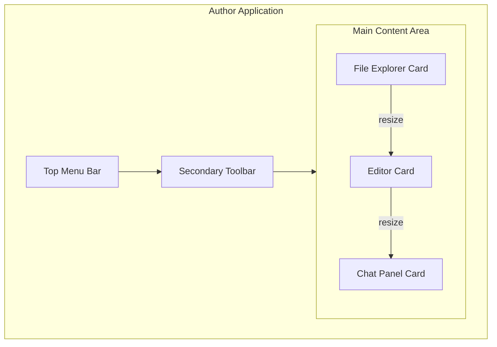

# Author UI Modernization Plan

## Current UI Analysis
- Three-column layout (File Explorer, Editor, Chat Panel)
- Resizable columns
- Dark theme with VS Code-like interface
- Top menu bar and secondary toolbar with mode selection

## Proposed Modernization

### 1. Card-Based Layout
- Implement a card-based design for the three main sections
- Add subtle shadows and rounded corners to each card
- Improve visual hierarchy and separation between sections

### 2. Visual Design Updates
- **Card Styling**:
  - Background: `#252526` (slightly lighter than current background)
  - Border: `1px solid #3c3c3c`
  - Border Radius: `8px`
  - Box Shadow: `0 2px 8px rgba(0, 0, 0, 0.2)`
  - Margin: `16px` between cards
  - Padding: `12px` inside cards

- **Header Bar**:
  - Keep the top menu bar as is
  - Update the secondary toolbar with better spacing and visual hierarchy
  - Add a subtle bottom border to separate from content

### 3. Layout Structure
```
┌─────────────────────────────────────────────────────────────────────────┐
│ File   Edit   View   Window   Help                                      │
├───────┬───────────────────────────────────────────────────────┬─────────┤
│       │                                                       │         │
│  ┌───────────────────────┐                        ┌───────────────────┐│
│  │     EXPLORER          │                        │  Select... ▼     ││
│  └───────────────────────┘                        └───────────────────┘│
│                                                                       │
│   E   │  ┌─────────────────────────────────────────┐        C         │
│   X   │  │  Fiction Writing ▼                      │        H         │
│   P   │  │                                         │        A         │
│   L   │  │                                         │        T         │
│   O   │  │                E D I T O R             │                  │
│   R   │  │                                         │                  │
│   E   │  │                                         │                  │
│   R   │  │                                         │                  │
│       │  └─────────────────────────────────────────┘                  │
└───────┴───────────────────────────────────────────────────────┬─────────┘
```

### 4. Component-Specific Updates

#### File Explorer Card
- Add a prominent header with 'EXPLORER' label
- Slightly rounded top corners
- Subtle hover effects on file items
- Better visual hierarchy for folders and files
- Consistent padding and spacing

#### Editor Card
- Clean header with 'Fiction Writing' dropdown and file tabs
- Subtle border to separate header from content
- Rounded corners
- Optional: Add a subtle gradient to the top border for depth
- Ensure proper spacing around the dropdown control

#### Chat Panel Card
- Header with 'Select...' dropdown for conversation selection
- Rounded corners
- Improved message bubbles with better spacing
- Subtle background for the input area
- Ensure dropdown is properly aligned in the header

### 5. Responsive Considerations
- Maintain current resizing functionality
- Ensure cards scale properly when resizing columns
- Add minimum width constraints to prevent cards from becoming too narrow

### 6. Animation and Transitions
- Smooth transitions for resizing
- Subtle hover effects on interactive elements
- Fade-in animations for card content

## Implementation Plan

1. **Phase 1: Base Styling**
   - Create new CSS variables for card styling
   - Update the WorkspaceLayout component to use card containers
   - Implement basic card layout with proper spacing

2. **Phase 2: Component Updates**
   - Update FileExplorer, MultiTabEditor, and ChatPanel components
   - Add card headers with consistent styling
   - Ensure proper padding and margins within cards

3. **Phase 3: Refinements**
   - Add subtle shadows and hover effects
   - Ensure proper dark theme support
   - Test with different content lengths

4. **Phase 4: Testing**
   - Test resizing functionality
   - Verify on different screen sizes
   - Check for performance impacts

## Visual Mockup



## Implementation Status

✅ **COMPLETED** - 2025-10-06

All planned changes have been successfully implemented:
- ✅ Card-based layout with proper spacing and shadows
- ✅ Integrated controls (mode selector in Editor, thread selector in Chat)
- ✅ Resizable chat input area (80px - 400px)
- ✅ Improved visual hierarchy and alignment
- ✅ Enhanced resize handles with visual feedback
- ✅ All existing functionality maintained

See `AUTHOR_PROGRESS/ui_modernization_implementation.md` for detailed implementation notes.

## Next Steps
1. ✅ Implementation complete
2. User testing and feedback collection
3. Minor refinements based on user feedback
4. Consider additional enhancements (theme customization, animations)
